## How to build an Arista vEOS virtual lab using GNS3 on Ubuntu 24.04 LTS

### Lab Hardware & Software Requirements

* ***Compute Hardware*** -- 8-core CPU or better with Intel VT-x/AMD-V virtualization extension support, 64GB RAM, (1) Gigabit NIC, & ≥400GB Disk  
* ***Linux OS*** -- Ubuntu 24.04 LTS (supporting software package versions will follow this distro & release)
* ***Virtual Lab Software*** -- GNS3 v2.2.48.1 configured as a server, with QEMU for the virtualization backend
* ***CloudVision-as-a-Service Tenant*** (Optional, but recommended)
    
### OS Installation

Ubuntu was chosen as the OS because of its reliability, ease of use, and broad community support. If you prefer to use an alternative Linux OS, you may need to seek additional instructions elsewhere as this document applies specifically to Ubuntu.

* Download Ubuntu 24.04 LTS ISO and prepare a bootable USB drive. Here are instructions on how to do so --
    https://ubuntu.com/tutorials/create-a-usb-stick-on-ubuntu

* Install Ubuntu 24.04 LTS with a GUI desktop manager (e.g. KDE, Plasma, etc.).

* During install, when prompted to create your first user account, create an account named "*gns3*". As the first user account created, it should have admin (aka *sudo*) privilege. This is also the account that the gns3server service (aka 'daemon') will run under.

### GNS3 Software Installation

* Once the OS install is complete and you've rebooted, install the base GNS3 packages using Ubuntu's apt installer. Any required software dependencies will be installed automatically:

```
    sudo add-apt-repository ppa:gns3/ppa
    sudo apt update
    sudo apt install gns3-gui gns3-server
    (optional) sudo apt install gns3-webclient-pack
```

* Install supplemental libvirt packages:
    
   `sudo apt install libvirt-clients libvirt-clients-qemu libvirt-daemon`

* Install other helpful utilities via apt (optional, but highly recommended):

    `sudo apt install openssh-server ntp vim virt-manager`

### GNS3 Server Configuration

* Add your user 'gns3' to the following groups -- *ubridge*, *libvirt*, *kvm*, *wireshark*

    `sudo usermod -aG ubridge,libvirt,kvm,wireshark gns3`

* Configure settings in *gns3_server.conf* configuration file to allow remote connectivity to GNS3:
    
    `vim ~/.config/GNS3/$VERSION/gns3_server.conf`
    
``` 
    [Server]
    path = /usr/bin/gns3server
    ubridge_path = /usr/bin/ubridge
    host = <server IP address>
    port = 3080
    auth = True
    user = <username of your choosing>
    password = <password of your choosing>
    protocol = http 
```

* In order to keep from having to manually start gns3server every time you want to use it, the following configuration will configure it to run as a service using systemd: 
    
    - Create a file called 'gns3server.service' in the directory */etc/systemd/system/* -- 
    
        `sudo vim /etc/systemd/system/gns3server.service`
    
    - Paste the following into the file 'gns3server.service' --
```
    [Unit]
    Description=GNS3 server
    Wants=network-online.target
    After=network.target network-online.target

    [Service]
    Type=forking
    User=gns3
    Group=gns3
    PermissionsStartOnly=true
    ExecStartPre=/bin/mkdir -p /var/log/gns3 /run/gns3
    ExecStartPre=/bin/chown -R gns3:gns3 /var/log/gns3 /run/gns3
    ExecStart=/usr/bin/gns3server --log /var/log/gns3/gns3.log --pid /run/gns3/gns3.pid --daemon
    ExecReload=/bin/kill -s HUP $MAINPID
    Restart=on-abort
    PIDFile=/run/gns3/gns3.pid
    
    [Install]
    WantedBy=multi-user.target
```

* Give the 'gns3server.service' file correct ownership:

    `sudo chown root:root /etc/systemd/system/gns3server.service`

* Tell systemd to enable the gns3server.service on system startup: 

    `sudo systemctl enable gns3server.service`

* To start the service:

    `sudo systemctl start gns3server.service`

* To stop the service:

    `sudo systemctl stop gns3server.service`

* To check status of the service:
    
    `sudo systemctl status gns3server.service`

### Upload vEOS image to GNS3 host system

* Download the latest vEOS-lab image in .qcow2 file format here:
https://www.arista.com/en/support/software-download

* Copy to the GNS3 host system. If you installed OpenSSH-server, then you can do this simply using the following command:

    `scp <file source location> gns3@<host system IP address>:/home/gns3/GNS3/images/QEMU/`

### Create the vEOS QEMU virtual machine template

* Launch GNS3 from the Ubuntu host system. Don't worry about opening a project just yet. Go to **'Edit'** -> **'Preferences'** -> **'QEMU'** and verify that both 'Enable' and 'Require' hardware acceleration are checked:

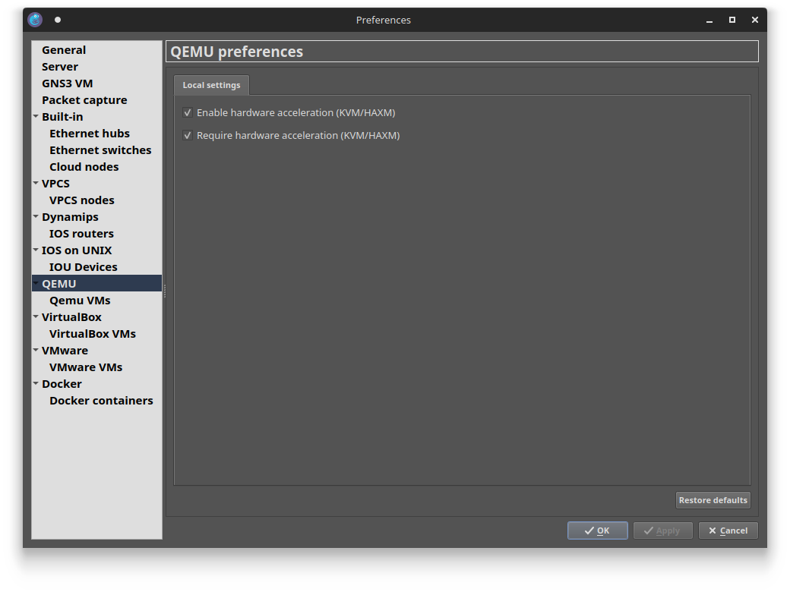

* Under **'Preferences'** -> **'QEMU'**, select **'QEMU VMs'** to launch the **'New QEMU VM template'** workflow. Choose a name for the VM:

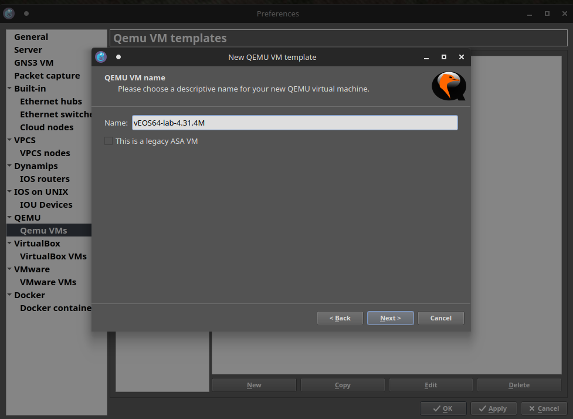

* The default QEMU binary should be correct, but verify nonetheless. Select a minimum of 2048 MB (2 GB) for the RAM allocation:

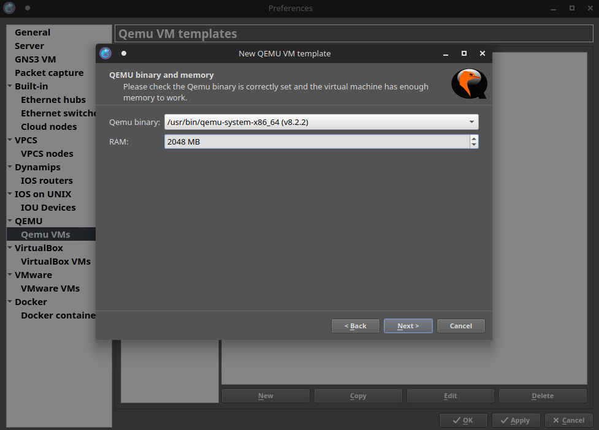

* Next, select the console type for the vEOS QEMU VMs you'll create. Leave as 'telnet':

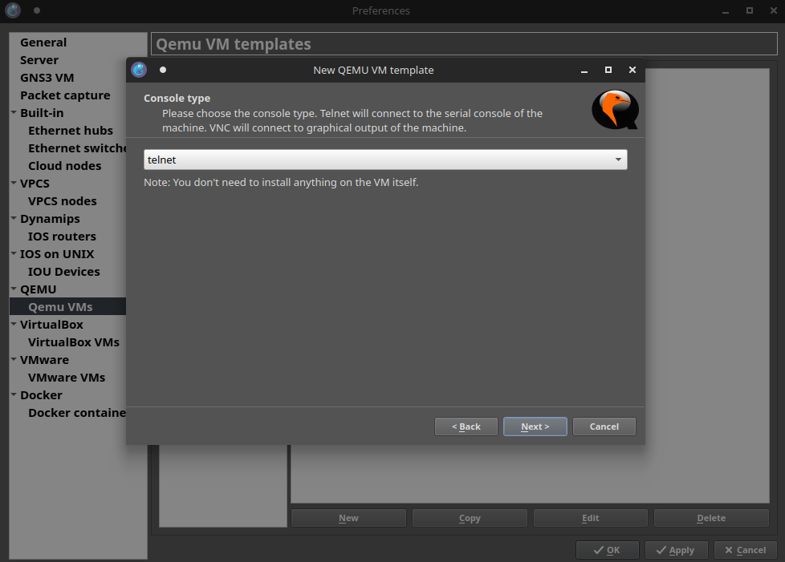

* Choose the disk image file (.qcow2) that you previously uploaded to the '/home/gns3/GNS3/images/QEMU directory': 

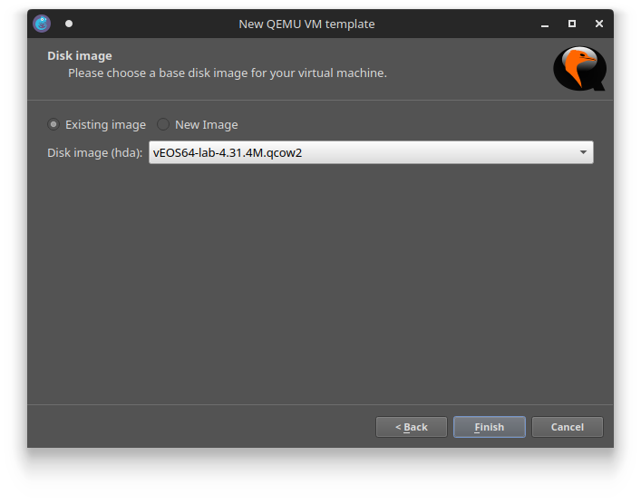 

* Select the vEOS VM you created and then click 'Edit': 

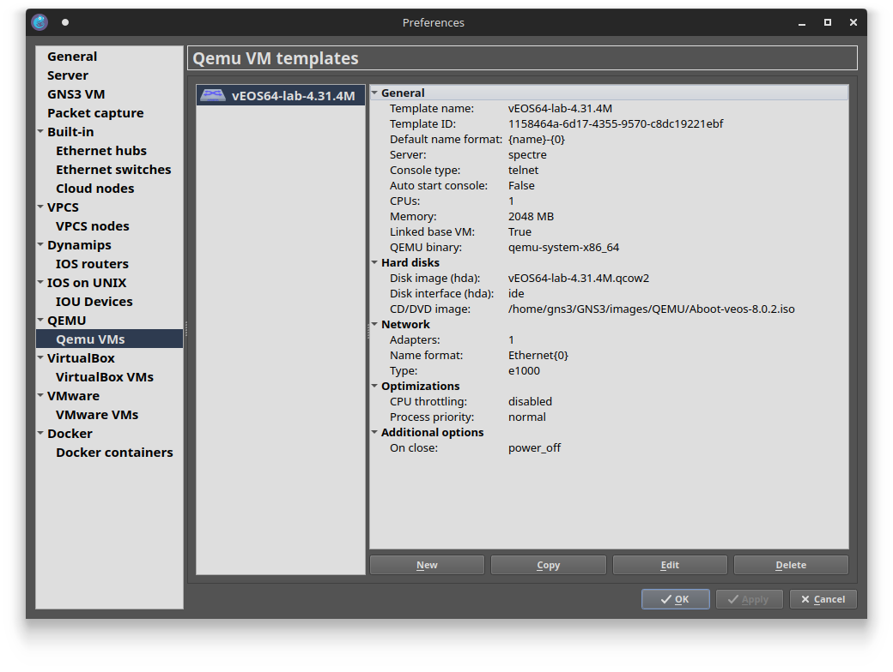

* Select the **'CD/DVD'** tab and browse for the **'Aboot-veos-<$version>.iso'** file previously saved in **'/home/gns3/GNS3/QEMU/images'**:

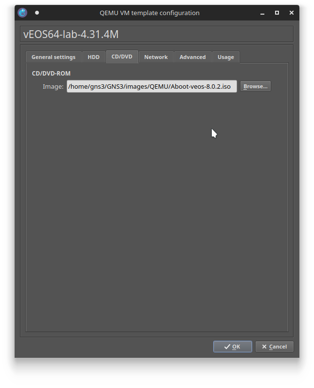 

### Instantiate your first vEOS VM in GNS3

* Click on **'File'** -> **'New Project'** and define the project name and location:

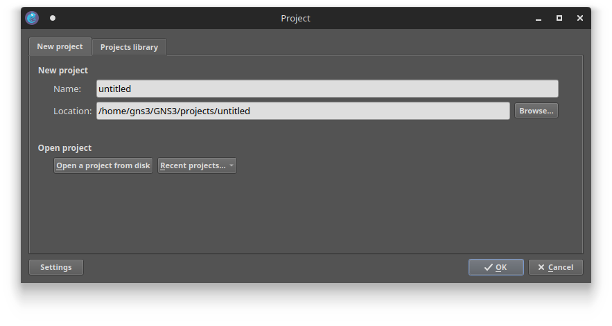

* From the left-hand side of the GNS3 interface, select the **'Browse all devices'** to show all the device templates available, including the new vEOS template:

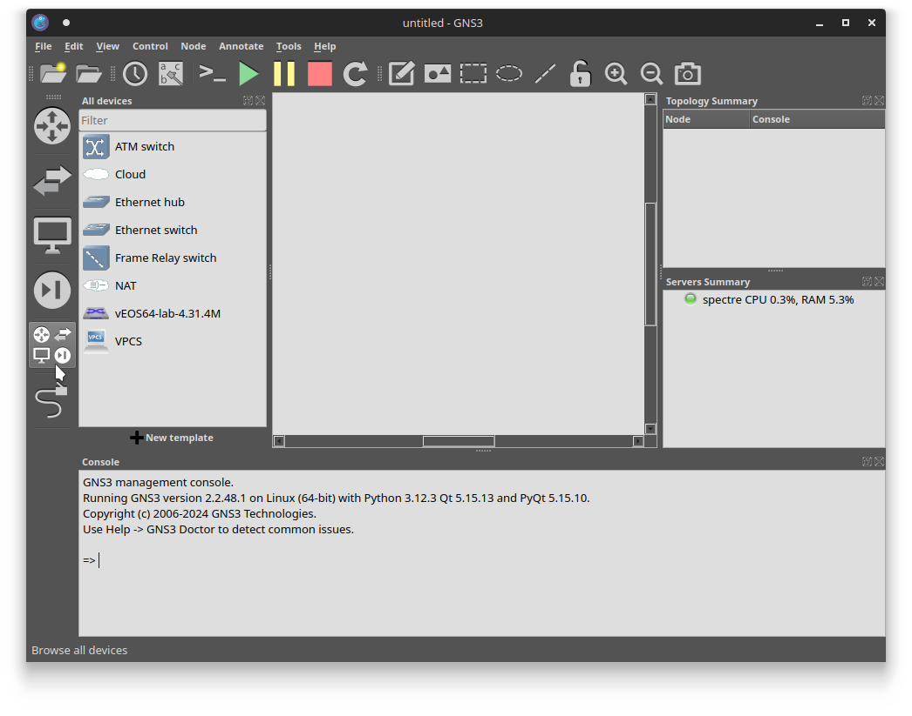

* Click on the vEOS template and drag it onto the blank topology workspace. This will create a new vEOS VM:

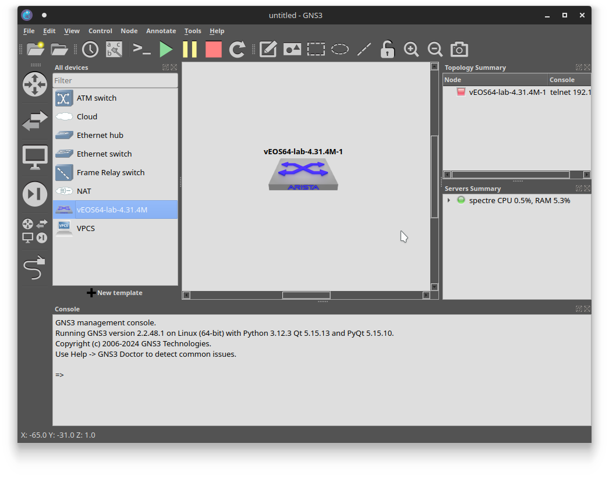

* Before starting the VM, right click on the VM and select **'Configure'**:

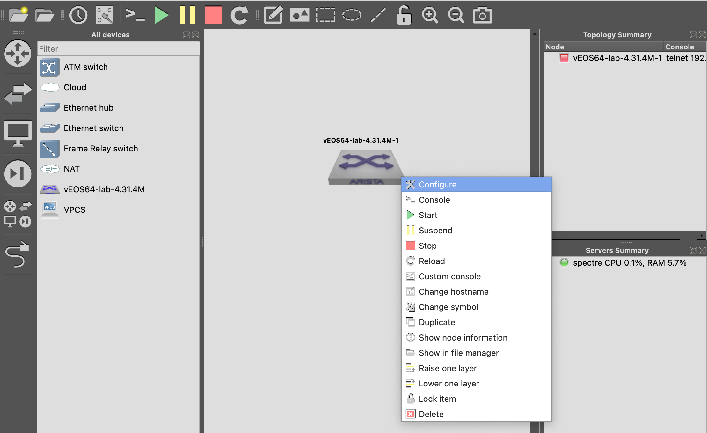

* In **'Node Properties'**, click on the **'Network'** tab. Change the number  of **'Adapters'** from '1' to a number ≤ 32, as vEOS-lab will only support a maximum of 32 virtual interfaces per physical NIC. Click 'Apply' & 'OK' to save the change:

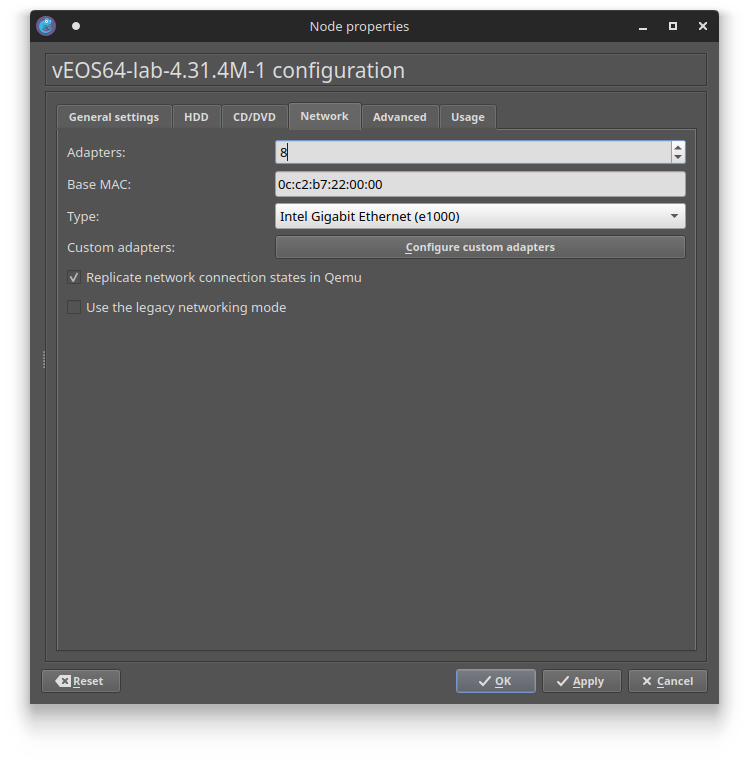

### Configure libvirt virtual networking for ZTP

GNS3 uses an open-source virtualization software on Ubuntu called **libvirt**. Libvirt gets installed alongside GNS3 and provides the virtual networking functionality to VMs managed by QEMU. It creates a virtual bridge (**virbr0**) to bridge the virtual and physical host networks. Automatically installed with libvirt is **dnsmasq** which provides simple DHCP & DNS services to the virtual networks. The **'default'** virtual network preconfigured with libvirt is configured with NAT in the private IP range 192.168.122.0/24. In order to utilize the ZTP feature of Arista's CloudVision, we need to define a new default network in libvirt that contains additional DHCP scope options required for ZTP to function.

Libvirt comes with its own shell called **'virsh'** which is a utility used to control all aspects of libvirt. We'll be using virsh to delete and recreate the default network to suit our needs.

* Before deleting the preconfigured 'default' libvirt network, back up its XML configuration. Then, copy the backup to a new .xml file. This file will be used in order to define a 'new-default' network:

```
  virsh net-dumpxml default | tee -a ~/default-net-dumpxml.bak

  cp ~/default-net-dumpxml.bak ~/new-default.xml
```

* Libvirt uses the concept of 'defining' a network for persistence. In our example, if the default network is simply 'destroyed' (virsh speak for 'deleted'), then subsequent new networks that are created will be based on the default network's 'definition'. So we will not only destroy the default network, but undefine it in preparation for redefining a new default network:

```
virsh net-destroy default
virsh net-undefine default
```

**NOTE:** Libvirt will only accept changes to its XML configuration using the 'virsh' command. This can be done on the fly with **'virsh net-edit \<virtual network name\>'**. However, in order to have backups of configuration changes, it is best to load changes by file with virsh. Additionally, any changes made to the config files generated by libvirt using virsh (e.g. */var/lib/libvirt/dnsmasq/dnsmasq.config*) will be potentially overwritten if they are edited outside of virsh.

* Edit the *'new-default.xml'* file to define additional DHCP scope options. In our case, we're defining two - Option 42 for NTP, with 0.0.0.0 indicating the host system as the NTP time source and Option 67 to specify an http URL where the ZTP bootstrap script resides:

```
vim ~/new-default.xml

(Add the following lines, remembering to respect XML tags)

<network xmlns:dnsmasq='http://libvirt.org/schemas/network/dnsmasq/1.0'>
  <name>new-default</name>
  <dnsmasq:options>
    <dnsmasq:option value='dhcp-option=42,0.0.0.0'/>
    <dnsmasq:option value='dhcp-option=67,http://192.168.2.9/bootstrap.py'/>
  </dnsmasq:options>
</network>
```

**-- OR BETTER YET --** 

* **Delete the contents of 'new-default.xml'** and **copy/paste the code block below labeled 'AFTER'**. 
Note that you will need to modify the IP address of the http:// server defined in Option 67 to reflect the IP of your host system. (HTTP server configuration to follow.)

For comparison -- 

**BEFORE**  (Old default network config):

```
<network>
  <name>default</name>
  <uuid>dfa0cf12-5bcb-4a38-aa32-73e5e8af5fac</uuid>
  <forward mode='nat'>
    <nat>
      <port start='1024' end='65535'/>
    </nat>
  </forward>
  <bridge name='virbr0' stp='on' delay='0'/>
  <mac address='52:54:00:2a:7d:89'/>
  <ip address='192.168.122.1' netmask='255.255.255.0'>
    <dhcp>
      <range start='192.168.122.2' end='192.168.122.254'/>
    </dhcp>
  </ip>
</network>
```

**AFTER** (New default network config):

```
<network xmlns:dnsmasq='http://libvirt.org/schemas/network/dnsmasq/1.0'>
  <name>new-default</name>
  <uuid>dfa0cf12-5bcb-4a38-aa32-73e5e8af5fac</uuid>
  <forward mode='nat'>
    <nat>
      <port start='1024' end='65535'/>
    </nat>
  </forward>
  <bridge name='virbr0' stp='on' delay='0'/>
  <mac address='52:54:00:2a:7d:89'/>
  <ip address='192.168.122.1' netmask='255.255.255.0'>
    <dhcp>
      <range start='192.168.122.10' end='192.168.122.254'/>
    </dhcp>
  </ip>
  <dnsmasq:options>
    <dnsmasq:option value='dhcp-option=42,0.0.0.0'/>
    <dnsmasq:option value='dhcp-option=67,http://192.168.2.9/bootstrap.py'/>
  </dnsmasq:options>
</network>
```

* The modified new-default.xml is now ready to use to define the 'new-default' network:

```
virsh net-define ~/new-default.xml
```

* Once defined successfully, the 'new-default' network can now be created for use:

```
virsh net-create new-default
```

* You'll notice that libvirt auto-generates a dnsmasq configuration file called **'new-default.conf'** in the directory **'/var/lib/libvirt/dnsmasq/'**. This file should now contain the additional DHCP options specified when creating the 'new-default' network:

```
ls -la /var/lib/libvirt/dnsmasq

drwxr-xr-x 2 root root 4096 Aug 21 13:48 .
-rw-r--r-- 1 root root    5 Aug 20 19:42 virbr0.status
-rw-r--r-- 1 root root    0 Aug 20 18:40 new-default.addnhosts
-rw-r--r-- 1 root root    0 Aug 20 18:40 new-default.hostsfile
-rw-r--r-- 1 root root  706 Aug 20 18:35 new-default.conf

(Below are the contents of 'new-default.conf')

##WARNING:  THIS IS AN AUTO-GENERATED FILE. CHANGES TO IT ARE LIKELY TO BE
##OVERWRITTEN AND LOST.  Changes to this configuration should be made using:
##    virsh net-edit new-default
## or other application using the libvirt API.
##
## dnsmasq conf file created by libvirt
strict-order
user=libvirt-dnsmasq
pid-file=/run/libvirt/network/new-default.pid
except-interface=lo
bind-dynamic
interface=virbr0
dhcp-range=192.168.122.10,192.168.122.254,255.255.255.0
dhcp-no-override
dhcp-authoritative
dhcp-lease-max=245
dhcp-hostsfile=/var/lib/libvirt/dnsmasq/new-default.hostsfile
addn-hosts=/var/lib/libvirt/dnsmasq/new-default.addnhosts
dhcp-option=42,0.0.0.0
dhcp-option=67,http://192.168.2.9/bootstrap.py
```

### HTTP server configuration for CVaaS ZTP bootstrap script

* Install an http server of your choice on your Ubuntu host system (nginx was chosen for this example):

```
sudo apt install nginx
```

* Download the Arista CloudVision-as-a-Service ZTP bootstrap script here:

https://github.com/aristanetworks/cloudvision-ztpaas-utils/blob/main/BootstrapScriptWithToken/bootstrap.py

* Copy the bootstrap script to /var/www/html/

* Change permissions on the bootstrap script to make it executable:
```
sudo chmod 755 /var/www/html/bootstrap.py
```

* Edit `bootstrap.py` and modify the "USER INPUT" section to specify the CVaaS cluster URL and the enrollment token. More information on how to do that can be found here -- 

https://github.com/aristanetworks/cloudvision-ztpaas-utils


### Connect GNS3 topology to the Internet  
In order to get connectivity from a vEOS instance to the host system or the Internet, a GNS3 'Cloud' or 'NAT' device must be added to GNS3's topology workspace and connected to the vEOS instance. Both Cloud and NAT devices in GNS3 by default use virbr0 and the default virtual network with NAT. In this example, we'll be using the NAT device with our freshly created 'new-default' virtual network.

* First, click on the 'All Devices' button on the left, select 'NAT' and drag over to the topology workspace:

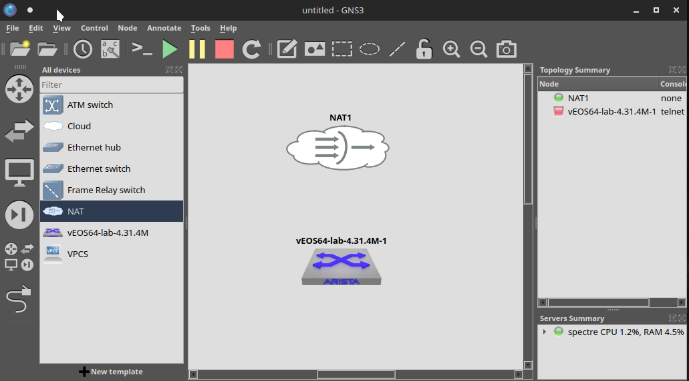

* Next, drag a generic 'ethernet switch' onto the topology. This unmanaged switch will act as an aggregation point for connecting vEOS instances (and any other devices) to the NAT network. Add a Virtual PC (VPC) for testing base connectivity/DHCP. Click on the 'Add a link' button on the left side to add a link between the NAT1 device and the generic ethernet switch. After clicking on the button, you'll notice a red 'X' appears over the button and your cursor should turn into a cross. Move the cross over the top of the ethernet switch and click on it to reveal a list of ethernet ports. Select a port by clicking on the red button next to the port name. Once you've done so, you'll notice that the cursor has a link line attached. Move the cursor over the NAT1 device, click on it to reveal the 'nat0' port. Now click on the red button next to 'nat0' to complete the link. Create a link in the same fashion for PC1:

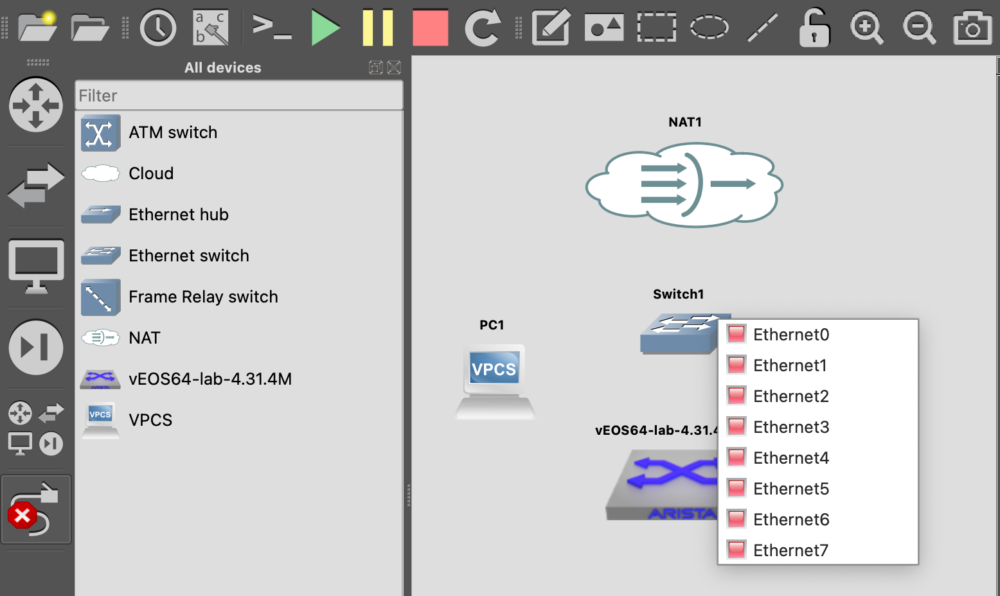

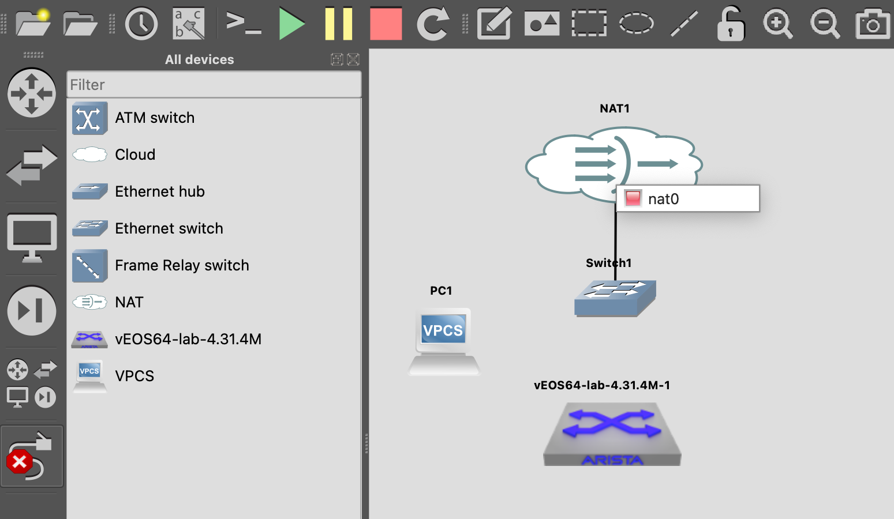

* Right click on 'PC1' to start the VM. The links should turn green and PC1 should have a green indicator next to it in the 'Topology Summary'. Double-click on the PC1 symbol get a telnet console. Verify that DHCP is issuing an address by entering the command '*ip dhcp*'. Ping an external host to verify reachability:

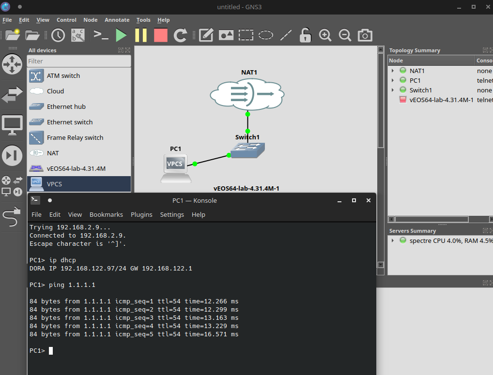

* Now create link from your vEOS switch to the generic ethernet switch, using Ethernet0 on the vEOS switch. Choose any available port on the generic switch:

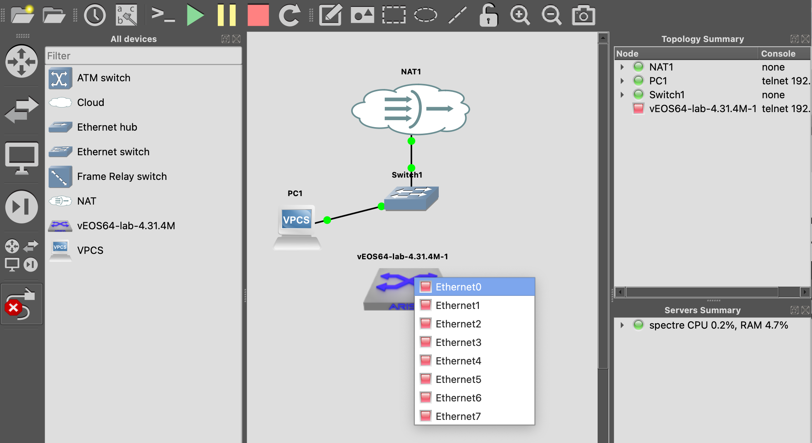

* Start the vEOS switch by right-clicking on its symbol and selecting 'Start'. Double-click on the symbol to get a console. Verify that it has been issued an IP address by DHCP and can successfully ZTP to CVaaS:

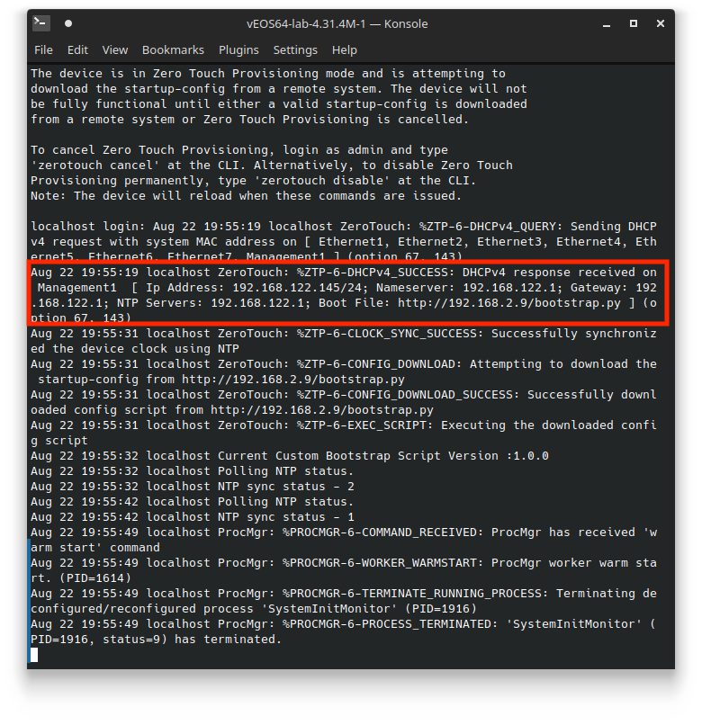

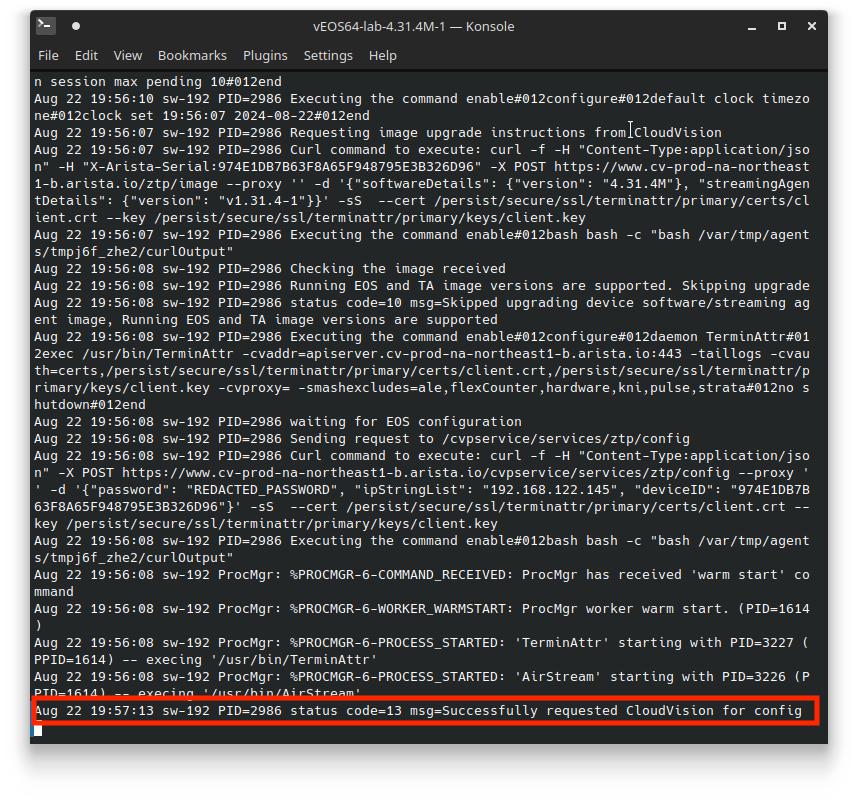

Congratulations! You've successfully built a vEOS lab using GNS3 on Ubuntu 24.04 and configured ZTP for CloudVision-as-a-Service!
